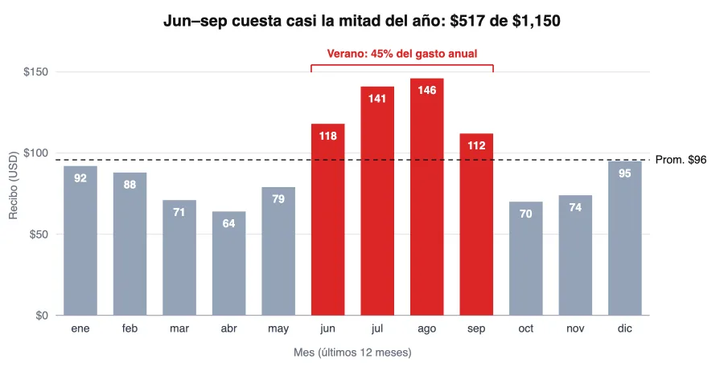
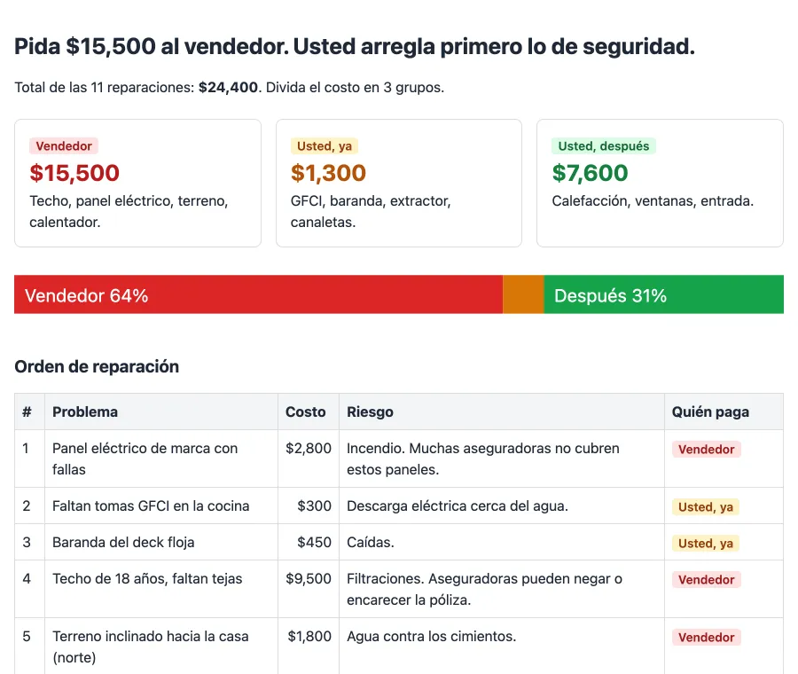

<p align="center"><a href="README.md">English</a> · <b>Español</b></p>

<p align="center">
  
</p>

<p align="center">
  <a href="#install"></a>
  <a href="#install"></a>
  <a href="#codex"></a>
  <a href="#pi"></a>
  <a href="LICENSE"></a>
</p>

## Por qué ASD-STE100

[ASD-STE100 Simplified Technical English](https://www.asd-ste100.org/) es la norma de escritura de los manuales de mantenimiento de aviones. Existe para que un mecánico, aunque el inglés no sea su idioma, lea una instrucción una vez y no la malinterprete. Tiene 53 reglas de escritura y un diccionario de unas 900 palabras aprobadas, cada una con un solo significado.

Las respuestas de los agentes tienen el mismo problema: largas, con rodeos y fáciles de malinterpretar. Este skill aplica cerca del 80% de STE a cada respuesta, en el idioma del usuario. Conserva las reglas que reducen el tiempo de lectura y deja fuera el diccionario estricto:

- Una idea por frase, menos de 20 palabras.
- Voz activa. Instrucciones en imperativo: "Corre X".
- Un término, un significado. Sin sinónimos para la misma cosa.
- Números concretos, nunca "varios" ni "significativo".
- Primero el resultado, después la evidencia, al final el siguiente paso.

| Escritura típica | Estilo STE |
|---|---|
| Probablemente sería buena idea considerar salir de casa un poco más temprano de lo normal, ya que los vuelos internacionales a veces pueden implicar filas más largas en el check-in y en seguridad. | Sal de casa a las 3:10 am. Llegas a JFK a las 4:10 am, 3 horas antes del vuelo. |

El texto es el nivel 1, y cada respuesta lo usa. Los otros niveles son extras ocasionales.

## La escalera

Cada respuesta es nivel 1. Un nivel más alto se agrega solo cuando se cumple su criterio.

| Nivel | Formato | Cuándo | Ejemplo |
|:--:|---|---|---|
| **1** | **Texto restringido**<br><sub>~80% ASD-STE100</sub> | Siempre. Resultado, evidencia, siguiente paso. |  |
| **2** | **Diagrama o gráfica**<br><sub>Mermaid o un SVG</sub> | Un flujo de 4 a 12 pasos, o una serie de datos cuya forma es la respuesta. |  |
| **3** | **HTML estático**<br><sub>un archivo, sin JS</sub> | Más de 6 hallazgos, más de una gráfica, una tabla de más de 5 columnas o 15 filas, o pides un reporte. |  |
| **4** | **Video explicativo**<br><sub>MP4 narrado</sub> | Solo si lo pides. Usa ElevenLabs si existe `ELEVENLABS_API_KEY`; si no, voz local. |  |

## Ejemplos

Respuestas reales, sin editar, generadas en español. Claude Opus 5.5 en Pi, contexto limpio.

### 1. Texto

La mayoría de las preguntas se quedan aquí. Mismo modelo, misma respuesta, menos que leer.

#### A qué hora salir al aeropuerto

**Preguntas:** Mi vuelo a Madrid sale a las 7:10 am desde JFK. Vivo a 45 minutos, llevo una maleta documentada y es internacional. ¿A qué hora debo salir de casa?

**Con el skill** (56% más corta)

> Sal de casa a las **3:10 am**.
>
> - **Llegada a JFK:** 3 horas antes del vuelo, a las 4:10 am. Esto es lo que se recomienda para un vuelo internacional con maleta documentada.
> - **Viaje:** 45 minutos. Si sales a las 3:10 am, llegas a las 3:55 am. Te quedan unos 15 minutos de margen para estacionar, tomar el AirTrain o caminar a la terminal.
> - **Límite de la maleta:** muchas aerolíneas cierran la entrega de maletas 60 minutos antes en vuelos internacionales, a las 6:10 am. Revisa el límite exacto de tu aerolínea.
>
> Si haces el check-in online y no usas el estacionamiento de larga estancia, puedes salir a las 3:30 am como muy tarde.

<details><summary><b>Sin el skill</b> (1,452 caracteres)</summary>

> ## Sal de casa a las **3:00 am**
>
> **Cálculo:**
>
> | Paso | Hora |
> |---|---|
> | Despegue | 7:10 am |
> | Llegada recomendada al aeropuerto (3 horas antes por ser vuelo internacional) | 4:10 am |
> | Trayecto de 45 minutos | 3:25 am |
> | Margen de 20 a 25 minutos para tráfico, estacionamiento, AirTrain o un Uber que tarde | **3:00 am** |
>
> **Por qué conviene llegar con 3 horas:**
> - Las aerolíneas suelen dejar de aceptar maletas documentadas en vuelos internacionales **unas 1 hora antes** de la salida. Ese límite casi siempre es estricto.
> - JFK tiene mucho movimiento temprano por la mañana, cuando salen muchos vuelos a Europa. Las filas en seguridad pueden ser largas.
> - En la puerta de embarque suelen revisar el pasaporte, y el embarque cierra unos 15 o 20 minutos antes del despegue.
>
> **Si quieres ajustar la hora:**
> - Si tienes **TSA PreCheck** o **CLEAR** y haces el check-in en línea, puedes salir a las **3:30 am** como máximo.
> - No salgas después de las **4:00 am**. Llegarías alrededor de las 4:45, y cualquier retraso pondría en riesgo la entrega de la maleta.
>
> **Consejos:**
> 1. Haz el check-in en línea 24 horas antes.
> 2. Confirma en qué **terminal** sale tu vuelo. En JFK los trayectos entre terminales son largos.
> 3. Revisa que tu pasaporte tenga al menos 3 meses de vigencia después de tu regreso, porque lo exige el espacio Schengen. Si viajas con pasaporte que no es de la UE, revisa también si necesitas el ETIAS.
>
> ¡Buen viaje a Madrid! ✈️

</details>

#### Mensaje al casero

**Preguntas:** Escríbele un mensaje corto a mi casero. El lavaplatos de la cocina lleva 4 días goteando. Le mandé una foto el lunes y no me ha respondido.

**Con el skill** (46% más corta)

> Aquí tienes el mensaje:
>
> > Hola, [nombre]. El lavaplatos de la cocina lleva 4 días goteando. Te mandé una foto el lunes, pero no he tenido respuesta. ¿Podrías decirme cuándo puedes mandar a alguien a arreglarlo? Gracias.
>
> Cambia [nombre] por el nombre de tu casero.

<details><summary><b>Sin el skill</b> (491 caracteres)</summary>

> Aquí tienes una propuesta:
>
> ---
>
> Hola [nombre]:
>
> Le escribo de nuevo por el lavaplatos de la cocina. Lleva 4 días goteando. El lunes le mandé una foto, pero todavía no he tenido respuesta. Me preocupa que el agua termine dañando el mueble o el piso.
>
> ¿Podría decirme cuándo puede venir alguien a revisarlo? Puedo coordinar el horario que le quede mejor.
>
> Gracias,
> [Tu nombre]
>
> ---
>
> Si lo quieres más firme, puedes añadir antes de despedirte: *"Le agradecería una respuesta antes del [día]."*

</details>

### 2. Gráfica

No pediste una gráfica. La respuesta es la forma de una serie de datos, así que el skill agrega una.

**Preguntas:** Mis recibos de luz en USD de los últimos 12 meses: ene 92, feb 88, mar 71, abr 64, may 79, jun 118, jul 141, ago 146, sep 112, oct 70, nov 74, dic 95. ¿Por qué sale tan alto algunos meses y cuánto pagué en total en el año?

> En el año pagaste **$1,150 USD** de luz, unos $96 al mes en promedio. Los meses altos casi seguro se deben al aire acondicionado en verano.
>
> **El patrón:**
> - **Junio a septiembre** suman $517, el 45% del año. Agosto fue el mes más caro, con $146.
> - **Abril** fue el mes más barato, con $64. Agosto costó 2.3 veces más.
> - **Diciembre y enero** ($95 y $92) suben un poco. Suele pasar por la calefacción, las noches más largas y las fiestas.
> - **Primavera y otoño** (mar–may, oct–nov) quedan entre $64 y $79. Así se ve tu consumo cuando no usas clima.



### 3. Reporte HTML

No pediste un reporte. 11 hallazgos son más de 6, así que el skill agrega un archivo HTML estático.

**Preguntas:** Las notas del inspector de la casa que quiero comprar. ¿Qué arreglo primero y qué le pido al vendedor que pague? 1) Techo: 18 años, faltan algunas tejas, cotización $9,500. 2) Calentador de agua: 14 años, óxido en la base, $1,400. 3) Panel eléctrico: marca conocida por fallar, $2,800. 4) El extractor del baño saca el aire al ático, $350. 5) Canaletas tapadas, $200. 6) Grieta en la entrada del carro, $1,200. 7) Faltan tomas GFCI en la cocina, $300. 8) Baranda del deck floja, $450. 9) Calefacción de 22 años, todavía funciona, $5,500. 10) Sellos rotos en 3 ventanas, $900. 11) El terreno se inclina hacia la casa en el lado norte, $1,800.

> Pídale al vendedor $15,500 para 4 reparaciones grandes. Usted paga primero $1,300 en reparaciones baratas de seguridad. Las 11 reparaciones suman $24,400.



<sub>Sin el skill: 3,344 caracteres de texto en el chat, sin archivo.</sub>

### 4. Video

El skill nunca ofrece un video. Si lo pides, primero escribe el guion y después renderiza un MP4 narrado.

## Instalación

Funciona en cualquier harness compatible con [Agent Skills](https://agentskills.io/specification).

```bash
git clone https://github.com/marcoleejr/explain-output.git
```

### Claude Code

```bash
mkdir -p ~/.claude/skills
cp -R explain-output/explain-output ~/.claude/skills/
```

Invócalo con `/explain-output`, o deja que Claude lo elija por la descripción.

### Codex

Codex lee la carpeta compartida de Agent Skills.

```bash
mkdir -p ~/.agents/skills
cp -R explain-output/explain-output ~/.agents/skills/
```

Reinicia Codex. Invócalo con `$explain-output`.

### Pi

```bash
pi install git:github.com/marcoleejr/explain-output
```

Invócalo con `/skill:explain-output`.

## Pruebas

10 escenarios con datos, 2 corridas cada uno, contexto limpio en Pi: formato correcto 20 de 20 con el skill (v2.3), 12 de 20 sin él. Las respuestas fueron 50% más cortas y todas abrieron con el resultado.

## Crédito

Idea: [Andrej Karpathy, 2 oct 2026](https://x.com/karpathy/status/2105819303471976479).

## Licencia

MIT. Ver [LICENSE](LICENSE).
