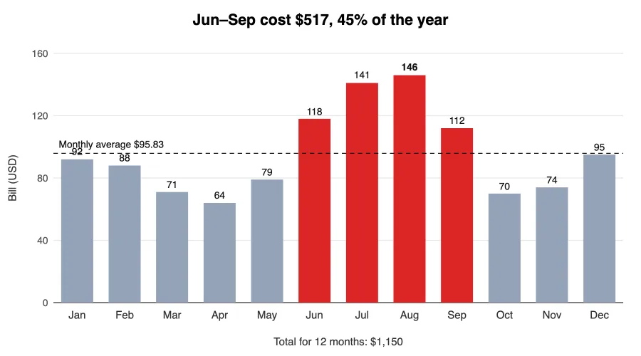
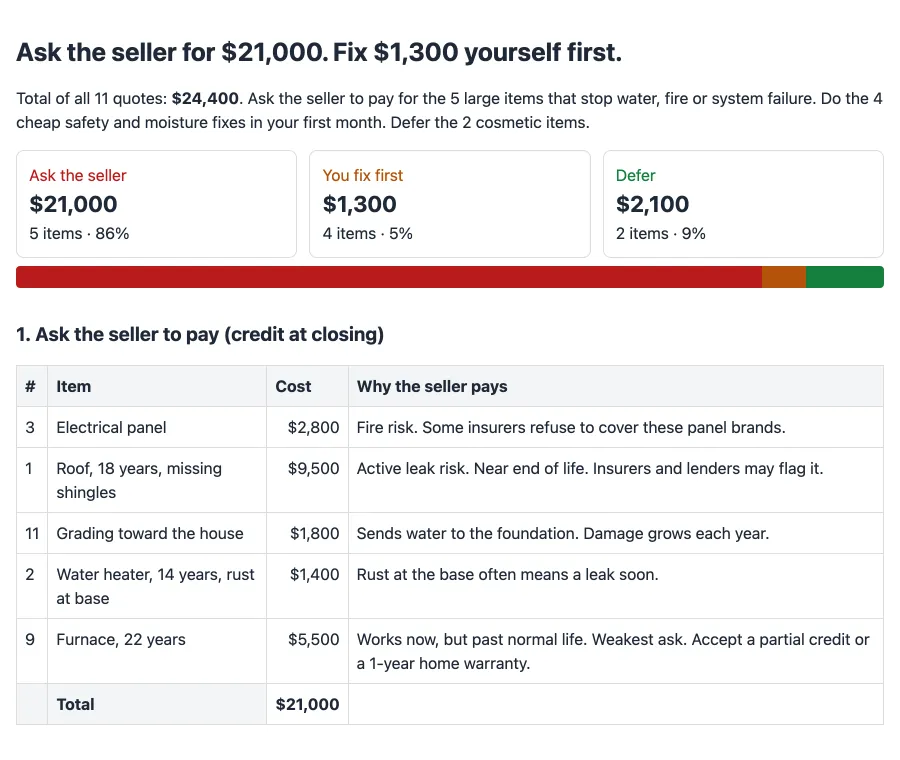

<p align="center"><b>English</b> · <a href="README.es.md">Español</a></p>

<p align="center">
  
</p>

<p align="center">
  <a href="#install"></a>
  <a href="#install"></a>
  <a href="#codex"></a>
  <a href="#pi"></a>
  <a href="LICENSE"></a>
</p>

## Why ASD-STE100

[ASD-STE100 Simplified Technical English](https://www.asd-ste100.org/) is the writing standard for aircraft maintenance manuals. It exists so that a mechanic, maybe not a native speaker, reads an instruction once and cannot get it wrong. It has 53 writing rules and a dictionary of about 900 approved words, each with one meaning.

Agent replies have the same problem: long, hedged, and easy to misread. This skill applies about 80% of STE to every reply. It keeps the rules that cut reading time and drops the strict dictionary:

- One idea per sentence, under 20 words.
- Active voice. Instructions in the imperative: "Run X".
- One term, one meaning. No synonyms for the same thing.
- Concrete numbers, never "several" or "significant".
- The result first, then the evidence, then the next step.

| Typical writing | STE-style |
|---|---|
| It would probably be a good idea to consider leaving home a little earlier than you normally would, since international flights can sometimes involve longer lines at check-in and security. | Leave home by 3:15 am. You reach JFK at 4:10 am, 3 hours before departure. |

Text is rung 1, and every reply gets it. The other rungs are rare extras on top.

## The ladder

Every reply is rung 1. A higher rung is added only when its criterion is met.

| Rung | Format | Use when | Example |
|:--:|---|---|---|
| **1** | **Constrained text**<br><sub>about 80% ASD-STE100</sub> | Always. Result first, then evidence, then next step. |  |
| **2** | **Diagram or chart**<br><sub>Mermaid or one SVG</sub> | A flow with 4–12 steps, or one data series where the shape is the answer. |  |
| **3** | **Static HTML**<br><sub>one file, no JS</sub> | More than 6 findings, more than one chart, a table over 5 columns or 15 rows, or you ask for a report. |  |
| **4** | **Explainer video**<br><sub>narrated MP4</sub> | Only when you ask. Uses ElevenLabs if `ELEVENLABS_API_KEY` is set, else local TTS. |  |

## Examples

Real replies, not edited. Claude Opus 5.5 in Pi, clean context.

### 1. Text

Most questions stop here. Same model, same answer, less to read.

#### When to leave for the airport

**You ask:** My flight to Madrid leaves at 7:10 am from JFK. I live 45 minutes away, I have a checked bag, and it's international. What time should I leave home?

**With the skill** (38% shorter)

> **Leave home by 3:15 am.** That gets you to JFK around 4:10 am, 3 hours before your 7:10 am departure.
>
> How the time works out:
>
> 1. **3:15 am:** Leave home. You said the drive takes 45 minutes.
> 2. **~4:00 am:** Arrive at JFK. Allow 10 minutes to park or get to the terminal.
> 3. **~4:10 am:** Start check-in and drop your bag. Most airlines stop taking checked bags on international flights 60 minutes before departure. Check your airline's exact cutoff.
> 4. **~4:45 am:** Go through security. JFK has a busy early wave of morning departures, so lines can be long.
> 5. **~6:20–6:40 am:** Boarding starts.
>
> If you want less stress, leave at 3:00 am. Don't leave later than 3:45 am, because that only leaves about 2.5 hours at the airport. Checking in online before you go and having TSA PreCheck both save time, but you still need to drop your bag in person.

<details><summary><b>Without the skill</b> (1,380 characters)</summary>

> **Leave home by about 3:15 a.m.**
>
> Here's how I got there:
> - **7:10 a.m.** Departure
> - **6:20–6:40 a.m.** Boarding usually starts 30–50 minutes before departure on international flights
> - **6:10 a.m.** Bag drop usually closes 60 minutes before departure for international flights. If you miss it, you can't check your bag.
> - **4:10 a.m.** Arrive at JFK. The standard advice for international flights is 3 hours early.
> - **~3:15 a.m.** Leave home. That's your 45-minute drive plus about 10–15 minutes extra for parking, the AirTrain, or rideshare drop-off.
>
> Some notes:
> - **Traffic should be light that early,** so 45 minutes is a fair estimate. If you're parking in long-term lots and taking the AirTrain, add another 15–20 minutes and leave around 3:00 a.m.
> - **Check-in counters may not be open yet** if you arrive before about 4:00 a.m., since some airlines open 3 hours before departure. That's another reason not to come much earlier.
> - **You could leave closer to 3:45 a.m.** if you have TSA PreCheck or Global Entry, check in online, and are fine with less buffer. That's cutting it close for an international flight with a checked bag, though, especially if the bag drop line is long.
> - **Look up your airline and terminal.** Iberia, Delta, and American fly JFK–Madrid out of different terminals, and their bag drop cutoffs can vary a bit.
>
> Have a great trip to Madrid! ✈️

</details>

#### Message to a landlord

**You ask:** Write a short message to my landlord. The kitchen sink has leaked for 4 days. I sent a photo on Monday and got no answer.

**With the skill** (34% shorter)

> Hi [Landlord's name],
>
> Our kitchen sink has leaked for 4 days now. I sent you a photo of it on Monday but have not heard back. Please arrange a repair as soon as possible, before the water causes more damage. Can you tell me by [day] when someone can come?
>
> Thanks,<br>
> [Your name]<br>
> [Unit / address]

<details><summary><b>Without the skill</b> (445 characters)</summary>

> Here's a draft:
>
> ---
>
> Hi [Landlord's name],
>
> The kitchen sink has been leaking for 4 days now. I sent you a photo on Monday but haven't heard back. Could you let me know today when someone can come fix it? I'm worried about water damage to the cabinet and floor if it keeps going.
>
> I'm usually available [times/days]. Thanks.
>
> [Your name]
> [Unit/address]
>
> ---
>
> If you want it firmer, you could add: "Please treat this as a formal repair request."

</details>

### 2. Chart

You did not ask for a chart. The answer is the shape of one data series, so the skill adds one.

**You ask:** My electricity bills in USD for the last 12 months: Jan 92, Feb 88, Mar 71, Apr 64, May 79, Jun 118, Jul 141, Aug 146, Sep 112, Oct 70, Nov 74, Dec 95. Why is it so high some months, and what is my yearly total?

> Your yearly total is **$1,150**, which averages to about $96 a month. Your bills are high in summer. June to September cost $517, which is 45% of the year.
>
> | Season | Months | Average per month |
> |---|---|---|
> | Summer | Jun–Sep | $129 |
> | Winter | Dec–Feb | $92 |
> | Spring and fall | Mar–May, Oct–Nov | $72 |



### 3. HTML report

You did not ask for a report. 11 findings is more than 6, so the skill adds one static HTML file.

**You ask:** The home inspector's notes for the house I want to buy. What do I fix first, and what should I ask the seller to pay for? 1) Roof: 18 years old, some missing shingles, quote $9,500. 2) Water heater: 14 years old, rust at the base, $1,400. 3) Electrical panel: brand known for failures, $2,800. 4) Bathroom fan vents into the attic, $350. 5) Gutters clogged, $200. 6) Crack in the driveway, $1,200. 7) GFCI outlets missing in the kitchen, $300. 8) Deck railing loose, $450. 9) Furnace 22 years old, still works, $5,500. 10) Window seals failed in 3 windows, $900. 11) Grading slopes toward the house on the north side, $1,800.

> I'd ask the seller to cover $21,000 of the $24,400 total, and do $1,300 of cheap safety fixes yourself first.



<sub>Without the skill: 3,595 characters of text in the chat, no file.</sub>

### 4. Video

The skill never offers a video. Ask for one and it writes the script first, then renders a narrated MP4.

## Install

Works in any harness that supports [Agent Skills](https://agentskills.io/specification).

```bash
git clone https://github.com/marcoleejr/explain-output.git
```

### Claude Code

```bash
mkdir -p ~/.claude/skills
cp -R explain-output/explain-output ~/.claude/skills/
```

Invoke with `/explain-output`, or let Claude pick it from the description.

### Codex

Codex reads the shared Agent Skills folder.

```bash
mkdir -p ~/.agents/skills
cp -R explain-output/explain-output ~/.agents/skills/
```

Restart Codex. Invoke with `$explain-output`.

### Pi

```bash
pi install git:github.com/marcoleejr/explain-output
```

Invoke with `/skill:explain-output`.

## Tested

10 data scenarios, 2 runs each, clean Pi context: right format 20 of 20 with the skill (v2.3), 12 of 20 without. Replies were 50% shorter and all opened with the result.

## Credit

Idea: [Andrej Karpathy, 2 Oct 2026](https://x.com/karpathy/status/2105819303471976479).

## License

MIT. See [LICENSE](LICENSE).
