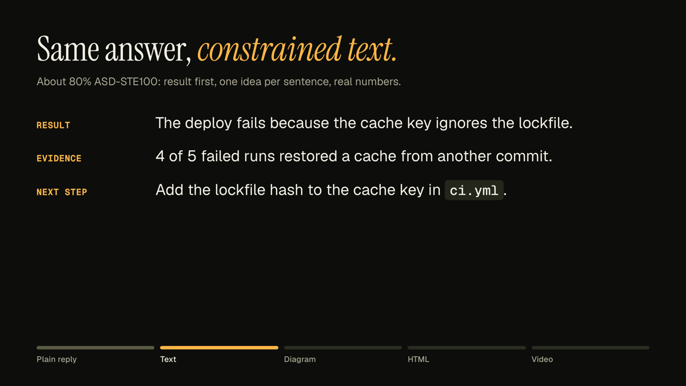
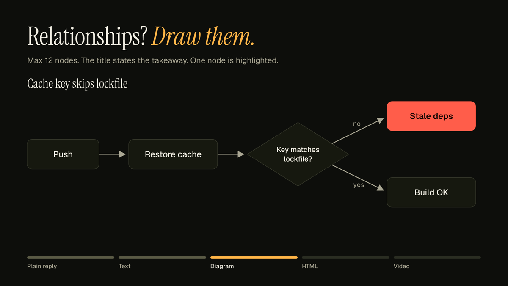
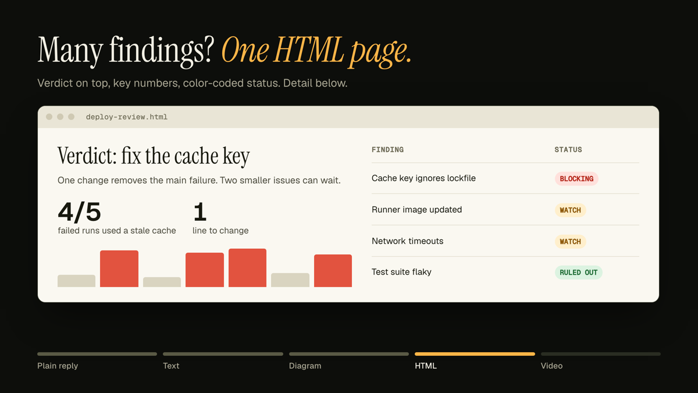
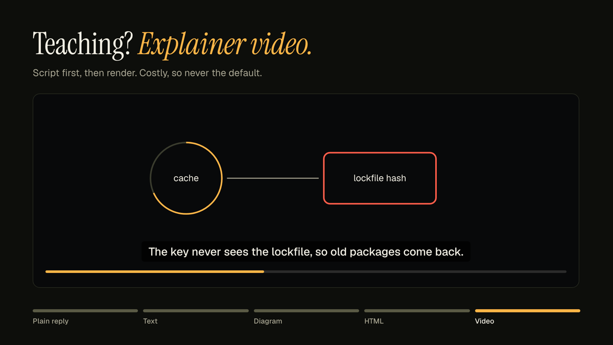

<p align="center">
  
</p>

<p align="center">
  <a href="#install"></a>
  <a href="#install"></a>
  <a href="#codex"></a>
  <a href="#pi"></a>
  <a href="LICENSE"></a>
</p>

<p align="center">
  <b>Your agent writes a wall of text. You asked for one number.</b><br>
  This skill makes the agent pick the format you can read fastest.
</p>

---

## What it changes

<p align="center">
  
</p>

The agent still writes the plain summary. It adds a richer format only when that format saves you time.

## The ladder

Pick the lowest rung that makes the content clear.

| Rung | Format | Use when | Example |
|:--:|---|---|---|
| **1** | **Constrained text**<br><sub>about 80% ASD-STE100</sub> | Default. Up to 3 findings, no relationships to show. |  |
| **2** | **Diagram**<br><sub>Mermaid, D2, SVG</sub> | The content is relationships: flows, architecture, timelines, decision trees. |  |
| **3** | **Single-file HTML**<br><sub>one .html file, no build</sub> | More than 3 findings, any data or metrics, audits, comparisons, plans. |  |
| **4** | **Explainer video**<br><sub>60–120 s, narration</sub> | Teaching or marketing content, or when you ask for it. Never the default. |  |

Rung 1 in full:

> **Result:** the deploy fails because the cache key ignores the lockfile.
> **Evidence:** 4 of 5 failed runs restored a cache from a different commit.
> **Next step:** add the lockfile hash to the cache key in `ci.yml`.

## Install

The skill is one folder with a `SKILL.md`. Any harness that supports the [Agent Skills](https://agentskills.io/specification) format can load it.

```bash
git clone https://github.com/marcoleejr/explain-output.git
```

### Claude Code

```bash
mkdir -p ~/.claude/skills
cp -R explain-output/explain-output ~/.claude/skills/
```

Project-only: use `.claude/skills/` in your repo instead.

### Codex

Codex reads the shared Agent Skills folder.

```bash
mkdir -p ~/.agents/skills
cp -R explain-output/explain-output ~/.agents/skills/
```

Project-only: use `.agents/skills/` in your repo. Restart Codex after installing.
Invoke it with `$explain-output`, or let Codex pick it from the description.

### Pi

```bash
pi install git:github.com/marcoleejr/explain-output
```

Add `-l` to install it for the current project only. Pi also reads `~/.agents/skills/`, so the Codex copy works too.
Invoke it with `/skill:explain-output`.

### Any other harness

Copy the `explain-output/` folder into the harness skills path. The folder name must match the `name` field.

## When it triggers

The description activates the skill when a reply **explains, reports, summarizes, audits, reviews or compares** something, or when it carries **more than 3 findings, data, metrics, flows, architecture, dependencies or timelines**. You can also invoke it by name.

## Capability fallbacks

The skill adapts to what your harness can do. It never fails because a tool is missing.

| Missing | What the skill does instead |
|---|---|
| Image rendering | Emits a fenced `mermaid` block. GitHub and most chat clients render it. |
| File sending | Writes the file and tells you the path and how to open it. |
| Screenshot tool | Skips the layout review pass. |
| TTS | Delivers the script and a silent animation. |

## Rules it follows

- Never fabricate a number to fill a chart or a table. Every number traces to tool output or your input.
- Write the plain-text summary first, even when an artifact is attached.
- Disposable is fine. A custom page for one decision is worth it if it saves reading time.
- Prefer the lower rung when two rungs both fit.

## Credit

The idea comes from Andrej Karpathy's post on X, 2 Oct 2026: ask for constrained text, then diagrams, then HTML, then bespoke explainer videos — [x.com/karpathy/status/2105819303471976479](https://x.com/karpathy/status/2105819303471976479).

## License

MIT. See [LICENSE](LICENSE).
