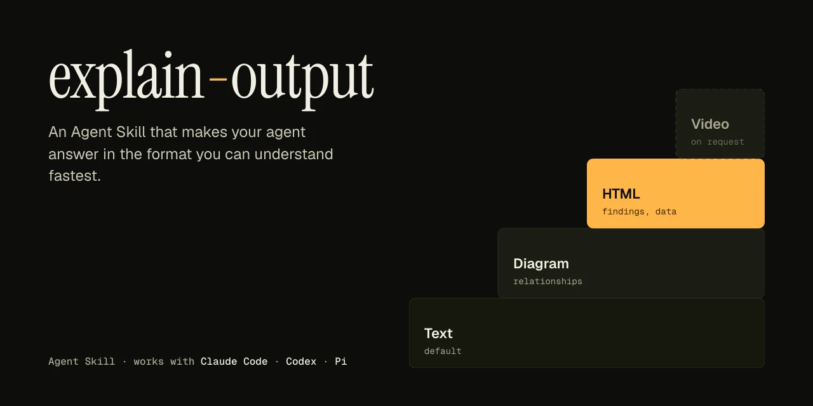
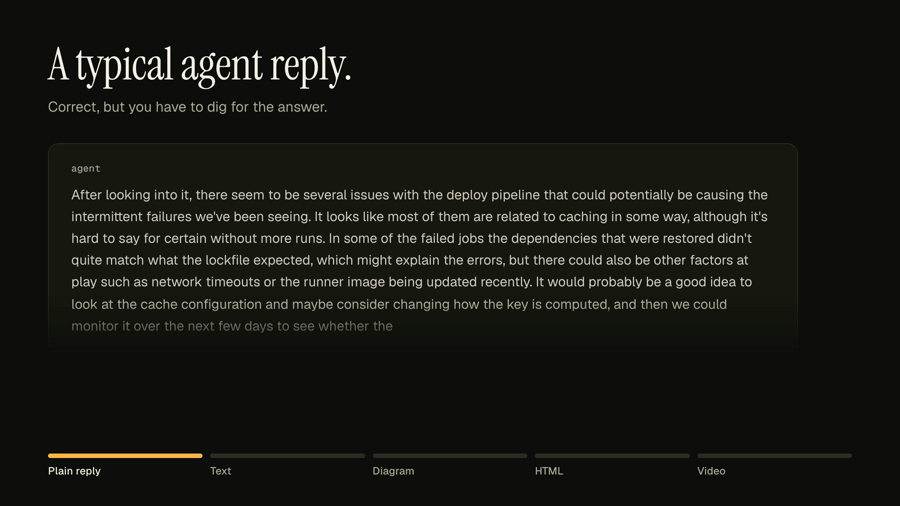
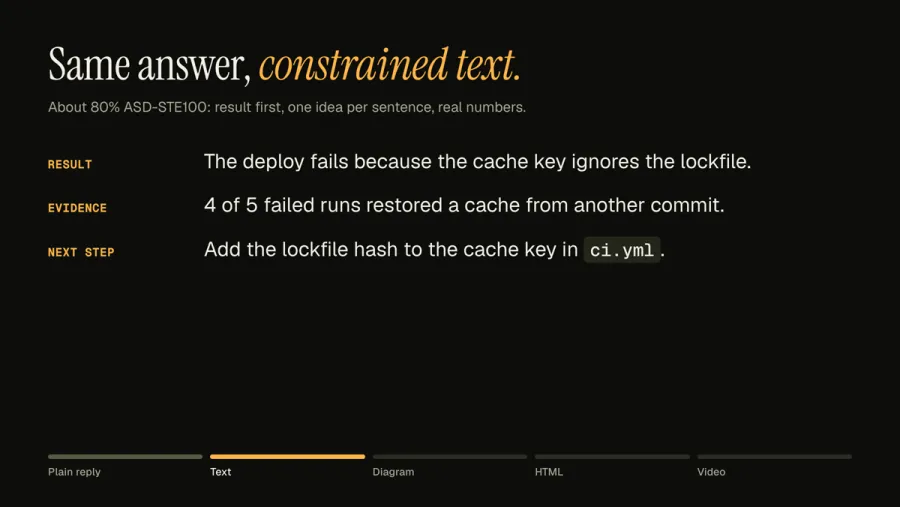
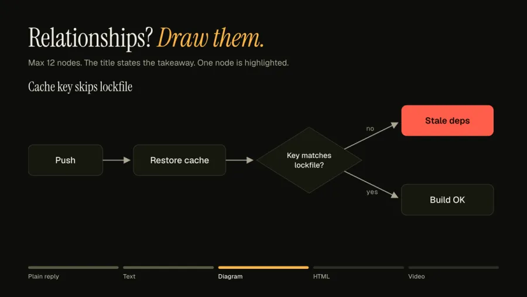
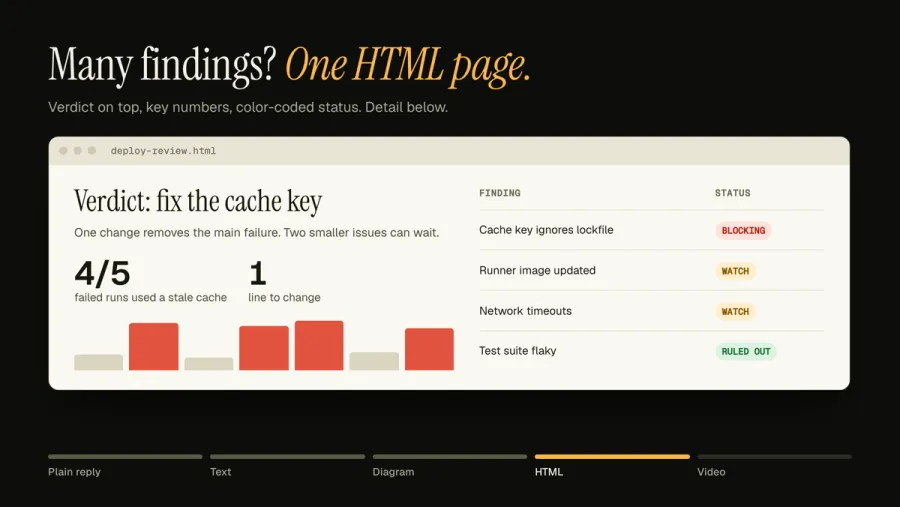
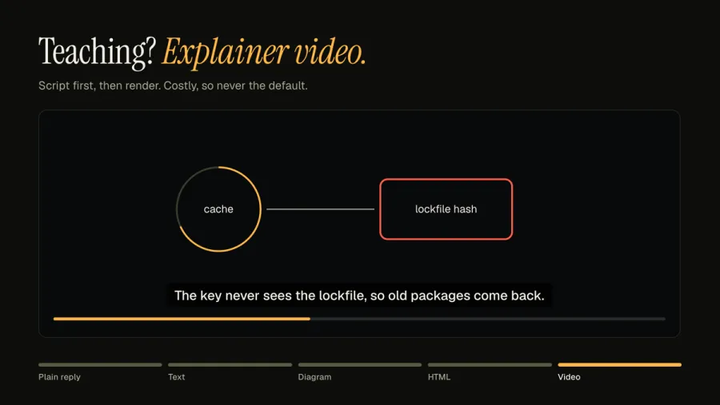

<p align="center">
  
</p>

<p align="center">
  <a href="#install"></a>
  <a href="#install"></a>
  <a href="#codex"></a>
  <a href="#pi"></a>
  <a href="LICENSE"></a>
</p>

<p align="center">
  <b>Your agent writes a wall of text. You asked for one number.</b><br>
  This skill makes the agent pick the format you can read fastest.
</p>

---

<p align="center">
  
</p>

## The ladder

Every reply is rung 1. A higher rung is added only when its criterion is met.

| Rung | Format | Use when | Example |
|:--:|---|---|---|
| **1** | **Constrained text**<br><sub>about 80% ASD-STE100</sub> | Always. Result first, then evidence, then next step. |  |
| **2** | **Diagram or chart**<br><sub>Mermaid or one SVG</sub> | A flow with 4–12 steps, or one data series where the shape is the answer. |  |
| **3** | **Static HTML**<br><sub>one file, no JS</sub> | More than 6 findings, more than one chart, a large table, or you ask for a report. |  |
| **4** | **Explainer video**<br><sub>narrated MP4</sub> | Only when you ask. Uses ElevenLabs if `ELEVENLABS_API_KEY` is set, else local TTS. |  |

## Install

The skill is one folder with a `SKILL.md`. Works in any harness that supports [Agent Skills](https://agentskills.io/specification).

```bash
git clone https://github.com/marcoleejr/explain-output.git
```

### Claude Code

```bash
mkdir -p ~/.claude/skills
cp -R explain-output/explain-output ~/.claude/skills/
```

### Codex

Codex reads the shared Agent Skills folder.

```bash
mkdir -p ~/.agents/skills
cp -R explain-output/explain-output ~/.agents/skills/
```

Restart Codex. Invoke with `$explain-output`.

### Pi

```bash
pi install git:github.com/marcoleejr/explain-output
```

Invoke with `/skill:explain-output`.

## Tested

10 data scenarios, 2 runs each, clean Pi context: right format 20 of 20 with the skill, 12 of 20 without. Replies were 50% shorter and all opened with the result.

## Credit

Idea: [Andrej Karpathy, 2 Oct 2026](https://x.com/karpathy/status/2105819303471976479).

## License

MIT. See [LICENSE](LICENSE).
