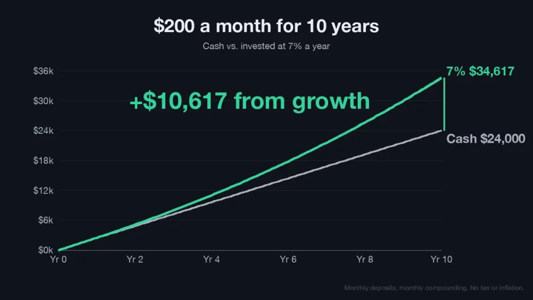

<p align="center">
  
</p>

<p align="center">
  <a href="#install"></a>
  <a href="#install"></a>
  <a href="#codex"></a>
  <a href="#pi"></a>
  <a href="LICENSE"></a>
</p>

## The ladder

Every reply is rung 1. A higher rung is added only when its criterion is met.

| Rung | Format | Use when | Example |
|:--:|---|---|---|
| **1** | **Constrained text**<br><sub>about 80% ASD-STE100</sub> | Always. Result first, then evidence, then next step. |  |
| **2** | **Diagram or chart**<br><sub>Mermaid or one SVG</sub> | A flow with 4–12 steps, or one data series where the shape is the answer. |  |
| **3** | **Static HTML**<br><sub>one file, no JS</sub> | More than 6 findings, more than one chart, a table over 5 columns or 15 rows, or you ask for a report. |  |
| **4** | **Explainer video**<br><sub>narrated MP4</sub> | Only when you ask. Uses ElevenLabs if `ELEVENLABS_API_KEY` is set, else local TTS. |  |

## Examples

Real replies, not edited. Claude Opus 5.5 in Pi, clean context.

### 1. Text

Everyday questions, with and without the skill.

#### Repair or replace a car

**You ask:** I have $3,000 in savings. My car needs a $1,100 repair, or I can buy a used one for $6,500 with $2,000 down and $190 a month. My current car is 11 years old with 180,000 km. What should I do?

**With the skill** (1,176 characters)

> **Repair your current car.** The $1,100 repair costs less than 6 months of the new car's payments ($1,140).
>
> | | Repair | Buy used |
> |---|---|---|
> | Cash spent now | $1,100 | $2,000 |
> | Savings left | $1,900 | $1,000 |
> | Monthly cost | $0 | $190 |
> | Cost over 12 months | $1,100 | $4,280 |
>
> Reasons to repair:
> - You keep $1,900 for emergencies. Buying leaves you only $1,000.
> - 180,000 km is high, but many well-maintained cars run past 250,000 km.
> - A used car can also need repairs. Then you pay for repairs and $190 a month.
>
> Buy the other car instead if any of these are true:
> - A mechanic finds other big problems soon, like the transmission, rust on the frame, or the head gasket.
> - Your repair costs in the last 12 months, plus this one, are more than $2,280. That is 1 year of payments.
> - The car is no longer safe.
>
> Next steps:
> 1. Ask the mechanic: "What other repairs will this car need in the next year?"
> 2. If the answer is "nothing major", do the repair.
> 3. Put $190 a month into a car fund. That pays for the next car in cash, with no loan interest.
>
> One thing is missing: you did not give the loan's interest rate or length. Check both before you sign anything.

<details><summary><b>Without the skill</b> (1,891 characters)</summary>

> **I'd fix the car.** Based on what you've shared, the repair is the better choice.
>
> **The numbers**
>
> | | Repair | Buy used |
> |---|---|---|
> | Upfront cost | $1,100 | $2,000 down |
> | Savings left | **$1,900** | **$1,000** |
> | Monthly payment | $0 | $190 |
> | Total cost | $1,100 | ~$6,500 or more with interest, plus possible extra tax, registration and insurance |
>
> - **$1,100 is less than 6 months of the loan payments.** If the repair keeps your car running for even half a year, it has paid for itself.
> - **Buying leaves you with only $1,000 in savings and a new monthly bill.** A used car can break down too. If that happens, you'd be paying for repairs and the loan at the same time.
> - **11 years and 180,000 km is old, but many cars go well past that.** Mileage alone isn't a reason to replace a car. How well it has been maintained matters more.
>
> **When buying would make more sense**
> - The repair is a sign of a bigger problem, like the transmission failing, serious rust or a cracked frame.
> - Your mechanic says more big repairs are coming soon. A useful rule: if you expect more than about $2,300 a year in repairs (12 months of $190 payments), replacing starts to win.
> - The repair costs more than the car is worth.
> - The car isn't safe, or it's so unreliable it could cost you your job.
>
> **Before you decide, ask your mechanic:**
> 1. Apart from this repair, what else is likely to need fixing in the next year?
> 2. Is the body and frame in good shape?
> 3. Would you keep driving this car yourself?
>
> **If you repair it:** Each month, put the $190 you would have spent on a car payment into savings. In about 2 years you'd have around $4,500 or more. Then you could buy your next car mostly or fully in cash, without interest, when you choose to rather than when you're forced to.
>
> If you share what the repair is for and the loan's interest rate, I can make this comparison more exact.

</details>

#### When to leave for the airport

**You ask:** My flight to Madrid leaves at 7:10 am from JFK. I live 45 minutes away, I have a checked bag, and it's international. What time should I leave home?

**With the skill** (854 characters)

> **Leave home by 3:15 am.** That gets you to JFK around 4:10 am, 3 hours before your 7:10 am departure.
>
> How the time works out:
>
> 1. **3:15 am:** Leave home. You said the drive takes 45 minutes.
> 2. **~4:00 am:** Arrive at JFK. Allow 10 minutes to park or get to the terminal.
> 3. **~4:10 am:** Start check-in and drop your bag. Most airlines stop taking checked bags on international flights 60 minutes before departure. Check your airline's exact cutoff.
> 4. **~4:45 am:** Go through security. JFK has a busy early wave of morning departures, so lines can be long.
> 5. **~6:20–6:40 am:** Boarding starts.
>
> If you want less stress, leave at 3:00 am. Don't leave later than 3:45 am, because that only leaves about 2.5 hours at the airport. Checking in online before you go and having TSA PreCheck both save time, but you still need to drop your bag in person.

<details><summary><b>Without the skill</b> (1,380 characters)</summary>

> **Leave home by about 3:15 a.m.**
>
> Here's how I got there:
> - **7:10 a.m.** Departure
> - **6:20–6:40 a.m.** Boarding usually starts 30–50 minutes before departure on international flights
> - **6:10 a.m.** Bag drop usually closes 60 minutes before departure for international flights. If you miss it, you can't check your bag.
> - **4:10 a.m.** Arrive at JFK. The standard advice for international flights is 3 hours early.
> - **~3:15 a.m.** Leave home. That's your 45-minute drive plus about 10–15 minutes extra for parking, the AirTrain, or rideshare drop-off.
>
> Some notes:
> - **Traffic should be light that early,** so 45 minutes is a fair estimate. If you're parking in long-term lots and taking the AirTrain, add another 15–20 minutes and leave around 3:00 a.m.
> - **Check-in counters may not be open yet** if you arrive before about 4:00 a.m., since some airlines open 3 hours before departure. That's another reason not to come much earlier.
> - **You could leave closer to 3:45 a.m.** if you have TSA PreCheck or Global Entry, check in online, and are fine with less buffer. That's cutting it close for an international flight with a checked bag, though, especially if the bag drop line is long.
> - **Look up your airline and terminal.** Iberia, Delta, and American fly JFK–Madrid out of different terminals, and their bag drop cutoffs can vary a bit.
>
> Have a great trip to Madrid! ✈️

</details>

#### Message to a landlord

**You ask:** Write a short message to my landlord. The kitchen sink has leaked for 4 days. I sent a photo on Monday and got no answer.

**With the skill** (294 characters)

> Hi [Landlord's name],
>
> Our kitchen sink has leaked for 4 days now. I sent you a photo of it on Monday but have not heard back. Please arrange a repair as soon as possible, before the water causes more damage. Can you tell me by [day] when someone can come?
>
> Thanks,
> [Your name]
> [Unit / address]

<details><summary><b>Without the skill</b> (445 characters)</summary>

> Here's a draft:
>
> ---
>
> Hi [Landlord's name],
>
> The kitchen sink has been leaking for 4 days now. I sent you a photo on Monday but haven't heard back. Could you let me know today when someone can come fix it? I'm worried about water damage to the cabinet and floor if it keeps going.
>
> I'm usually available [times/days]. Thanks.
>
> [Your name]
> [Unit/address]
>
> ---
>
> If you want it firmer, you could add: "Please treat this as a formal repair request."

</details>

### 2. Chart

**You ask:** My electricity bills in USD for the last 12 months: Jan 92, Feb 88, Mar 71, Apr 64, May 79, Jun 118, Jul 141, Aug 146, Sep 112, Oct 70, Nov 74, Dec 95. Why is it so high some months, and what is my yearly total?

> Your total for the 12 months is **$1,150**, which averages $95.83 a month.
>
> Most of the high cost comes from the summer. June to September cost $517, which is 45% of the year in only 4 months. That pattern usually means air conditioning.


### 3. HTML report

**You ask:** Help me pick an apartment and give me a report. A: $1,450, 62 m2, 25 min commute, 3rd floor no elevator, pets ok, no parking. B: $1,620, 70 m2, 15 min, elevator, no pets, parking. C: $1,380, 55 m2, 40 min, ground floor, pets ok, parking. D: $1,700, 80 m2, 20 min, elevator, pets ok, no parking. E: $1,520, 65 m2, 30 min, 2nd floor, no pets, parking. F: $1,410, 58 m2, 35 min, elevator, pets ok, parking. I have a dog and I drive to work.

> I recommend apartment F. It's $1,410 for 58 m², with a 35 min commute, an elevator, pets allowed and parking.


### 4. Video

**You ask:** Make a 20-second video that shows how saving $200 a month grows over 10 years at 7% a year, compared with keeping it in cash. Use ffmpeg (it is on the PATH) and narrate it. Save the MP4 in this directory.

> The video is ready: `savings-200-month-10-years.mp4`. It runs exactly 20 seconds at 1280×720 and has a voiceover.
>
> **Result:** after 10 years, cash holds $24,000 and the 7% account holds $34,617. That is $10,617 more, from growth alone.

<a href="assets/ex-video.mp4"></a>

<sub>Click the image to play the 20-second MP4 with narration.</sub>

## Install

Works in any harness that supports [Agent Skills](https://agentskills.io/specification).

```bash
git clone https://github.com/marcoleejr/explain-output.git
```

### Claude Code

```bash
mkdir -p ~/.claude/skills
cp -R explain-output/explain-output ~/.claude/skills/
```

Invoke with `/explain-output`, or let Claude pick it from the description.

### Codex

Codex reads the shared Agent Skills folder.

```bash
mkdir -p ~/.agents/skills
cp -R explain-output/explain-output ~/.agents/skills/
```

Restart Codex. Invoke with `$explain-output`.

### Pi

```bash
pi install git:github.com/marcoleejr/explain-output
```

Invoke with `/skill:explain-output`.

## Tested

10 data scenarios, 2 runs each, clean Pi context: right format 20 of 20 with the skill (v2.3), 12 of 20 without. Replies were 50% shorter and all opened with the result.

## Credit

Idea: [Andrej Karpathy, 2 Oct 2026](https://x.com/karpathy/status/2105819303471976479).

## License

MIT. See [LICENSE](LICENSE).
