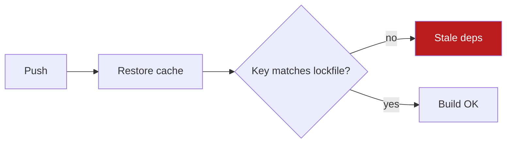

# Explain output

Goal: the reader spends the least time to understand and decide.

Source idea: Andrej Karpathy, post on X, 2 Oct 2026, https://x.com/karpathy/status/2105819303471976479 (accessed 8 Oct 2026). Paraphrase: people will spend more time understanding model outputs. Ask for constrained text (ASD-STE100), then diagrams, interactive HTML pages, and custom explainer videos. Cheap code makes disposable custom artifacts practical.

## Pick the format

Use the lowest rung that makes the content clear. Always write the plain-text summary first, even when you attach an artifact.

| Rung | Format | Use when |
|---|---|---|
| 1 | Constrained text | Default. Up to 3 findings or 6 facts. No relationships to show. |
| 2 | Diagram | The content is relationships: flows, architecture, dependencies, timelines, before/after, decision trees. |
| 3 | Single-file HTML | More than 3 findings, data or metrics, audits, code reviews, comparisons, plans with options. Anything the reader will scan rather than read. |
| 4 | Explainer video | Teaching or marketing content, or when the user asks. Costly. Never the default. |

If two rungs fit, pick the lower one. If the user names a format, use it.

## Rung 1 — Constrained text

Target: about 80% compliance with ASD-STE100 (Simplified Technical English), applied to the user's language.

Rules:

1. Lead with the result or decision. Then evidence. Then next step.
2. One idea per sentence. Keep sentences under 20 words. Procedure steps under 15.
3. Active voice. Imperative for instructions: "Run X", not "X should be run".
4. One term, one meaning. Use the same word for the same thing every time.
5. Concrete nouns and numbers. No "several", "some", "significant".
6. No filler, hedging, motivation, or restating the question.
7. Bulleted list for parallel items. Numbered list only for sequences.
8. Keep code, commands and error text in fenced blocks, not in prose.

Example.

Before:
> After looking into it, there seem to be several issues with the deploy pipeline that could potentially be causing the intermittent failures we've been seeing, mostly around caching.

After:
> **Result:** the deploy fails because the cache key ignores the lockfile.
> **Evidence:** 4 of 5 failed runs restored a cache from a different commit.
> **Next step:** add the lockfile hash to the cache key in `ci.yml`.

## Rung 2 — Diagram

- Write Mermaid (or D2) source. If you can render to PNG, SVG or WebP and send the image, do that. If you cannot, put the source in a fenced ```mermaid block. Most chat clients and GitHub render it.
- Limit to 12 nodes. Labels under 4 words.
- Highlight the one node that matters (color or bold).
- The title states the takeaway, not the topic. "Cache key skips lockfile", not "Deploy pipeline".
- Use high contrast. If you render, prefer a dark background.

Example:



## Rung 3 — Single-file HTML

- One self-contained `.html` file. Inline CSS and JS. A chart library from a CDN is acceptable. No build step.
- Top of page: verdict in 3 lines plus the key numbers. Detail below, collapsible.
- Use tables, charts, and green/amber/red status. Add a sticky nav for long reports.
- Mobile-readable: one column under 600px, text at least 16px.
- Save to a scratch or docs location the user controls. Suggested default: `./explain/<slug>.html` in the working directory, or the project's docs folder if the report should persist. Do not commit disposable artifacts.
- Send the file plus a 3-line text summary. If the environment cannot send files, write the path and say how to open it.
- If the environment can take a screenshot, do one review pass for layout problems before sending. If it cannot, skip this step.

Minimal skeleton:

```html
<!doctype html>
<html lang="en"><head><meta charset="utf-8">
<meta name="viewport" content="width=device-width,initial-scale=1">
<title>Verdict: cache key skips lockfile</title>
<style>
body{font:16px/1.5 system-ui;max-width:900px;margin:2rem auto;padding:0 1rem}
.ok{color:#15803d}.warn{color:#b45309}.bad{color:#b91c1c}
table{border-collapse:collapse;width:100%}td,th{border:1px solid #ddd;padding:.5rem}
@media(max-width:600px){body{margin:1rem auto}}
</style></head><body>
<h1>Verdict: fix the cache key</h1>
<p><b>4 of 5</b> failed runs used a stale cache. One change fixes it.</p>
<table><tr><th>Finding</th><th>Status</th><th>Action</th></tr>
<tr><td>Cache key ignores lockfile</td><td class="bad">Blocking</td><td>Add lockfile hash</td></tr>
</table>
<details><summary>Evidence</summary><pre>...tool output...</pre></details>
</body></html>
```

## Rung 4 — Explainer video

- Style: animated explanation with narration (for example Manim, or HTML/canvas captured with ffmpeg).
- Write the script in constrained text first. Get the script approved before rendering.
- Length 60 to 120 seconds. Use 16:9 for lessons, 9:16 for short-form vertical.
- Narration: use a local or free TTS if one is available. Use a paid TTS only when the user already has a key and agrees to the cost. If no TTS is available, deliver the script and the silent animation.

## Rules

- Never fabricate data to fill a chart or table. Every number must trace to tool output or user input.
- Disposable artifacts are fine. Build a custom page for one decision if it saves the reader time.
- Keep the text summary even when you attach an artifact. The reader may never open the file.
- When the environment lacks a capability (render, send files, screenshot, TTS), fall back one rung and say so in one line.
