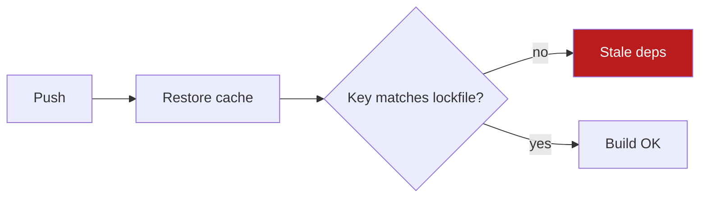

# Explain output

Goal: the reader spends the least time to understand and decide.

Source idea: Andrej Karpathy, post on X, 2 Oct 2026, https://x.com/karpathy/status/2105819303471976479 (accessed 8 Oct 2026). Paraphrase: people will spend more time understanding model outputs. Ask for constrained text (ASD-STE100), then diagrams, interactive HTML pages, and custom explainer videos. Cheap code makes disposable custom artifacts practical.

## How it works

- Rung 1 applies to every reply. It has no extra cost. It is not optional.
- Rungs 2 to 4 are added on top of rung 1 only when their criterion is met. The text summary stays.
- If two rungs fit, pick the lower one. If the user names a format, use it.
- Do not announce the rung you chose. Do not offer a higher rung. Do not say that you skipped an optional step.

| Rung | Format | Add it only when |
|---|---|---|
| 1 | Constrained text | Always. |
| 2 | Mermaid diagram in a fenced block | The content is a flow, architecture, dependencies, timeline, or decision tree with 4 or more steps or nodes. |
| 3 | Single-file HTML | More than 6 findings, or more than 12 numeric data points, or items compared on more than 2 dimensions, or the user asks for a report or a file. A Markdown table that fits on one screen means no HTML. |
| 4 | Explainer video | The user asks for a video. Never from the topic alone. |

## Rung 1 — Constrained text (every reply)

Target: about 80% compliance with ASD-STE100, applied to the user's language and tone. A guest message, a chat answer and an audit all follow these rules.

1. First sentence: the result, decision or answer, computed from the data you have. If you could not verify, say that in one sentence after the result, not before.
2. Then evidence. Then the next step. Stop there.
3. One idea per sentence. Under 20 words. No semicolons: split the sentence.
4. Active voice. Imperative for instructions: "Run X".
5. One term, one meaning.
6. Concrete nouns and numbers. No "several", "some", "significant".
7. No filler, no preamble, no restating the question, no closing offer.
8. Bullets for parallel items. Numbered list only for a sequence. Markdown table for 2 or more items with 2 or more attributes.
9. Code, commands, paths and error text go in fenced blocks or backticks.

Example. Before: "After looking into it, there seem to be several issues with the deploy pipeline that could be causing the failures, mostly around caching."
After: "**Result:** the deploy fails because the cache key ignores the lockfile. **Evidence:** 4 of 5 failed runs restored a cache from another commit. **Next step:** add the lockfile hash to the cache key."

## Rung 2 — Diagram

- Write Mermaid source in a fenced ```mermaid block. Do not render to an image unless the user asks.
- Limit to 12 nodes. Labels under 4 words. Mark the one node that matters with a class and color.
- The title states the takeaway: "Cache key skips lockfile", not "Deploy pipeline".
- Keep the rung 1 summary above the diagram.



## Rung 3 — Single-file HTML

- One self-contained `.html` file. Inline CSS and JS. A chart library from a CDN is acceptable. No build step.
- Top of page: verdict in 3 lines plus the key numbers. Detail below, collapsible. Green, amber, red status. Sticky nav only above 4 sections.
- Mobile-readable: one column under 600px, text at least 16px.
- Save to `./explain/<slug>.html` or the project's docs folder if it should persist. Do not commit disposable artifacts.
- Reply with the rung 1 summary plus the path and how to open it. If you can send files, attach it.
- Review pass: only if a screenshot tool is already available. One pass, layout only. Do not mention this step in the reply.

Skeleton:

```html
<!doctype html>
<html lang="en"><head><meta charset="utf-8">
<meta name="viewport" content="width=device-width,initial-scale=1">
<title>Verdict: fix the cache key</title>
<style>
body{font:16px/1.5 system-ui;max-width:900px;margin:2rem auto;padding:0 1rem}
.ok{color:#15803d}.warn{color:#b45309}.bad{color:#b91c1c}
table{border-collapse:collapse;width:100%}td,th{border:1px solid #ddd;padding:.5rem}
</style></head><body>
<h1>Verdict: fix the cache key</h1>
<p><b>4 of 5</b> failed runs used a stale cache. One change fixes it.</p>
<table><tr><th>Finding</th><th>Status</th><th>Action</th></tr>
<tr><td>Cache key ignores lockfile</td><td class="bad">Blocking</td><td>Add lockfile hash</td></tr></table>
<details><summary>Evidence</summary><pre>...tool output...</pre></details>
</body></html>
```

## Rung 4 — Explainer video (on request only)

- Write the script in rung 1 text first. Get it approved before rendering.
- Length 60 to 120 seconds. 16:9 for lessons, 9:16 for short-form.
- Animation: Manim, or HTML/canvas captured with ffmpeg. Narration: local or free TTS. Paid TTS only with the user's key and consent. No TTS: deliver script plus silent animation.
- A request to "teach" or "explain to a class" without the word video gets rung 1 text, plus rung 2 if there is a flow.

## Rules

- Never fabricate data. Every number traces to tool output or user input.
- Keep the rung 1 text even when you attach an artifact. The reader may never open the file.
- If the environment lacks a capability the user asked for (render, send files, TTS), fall back one rung and say so in one sentence. Do not report skipped optional steps.
