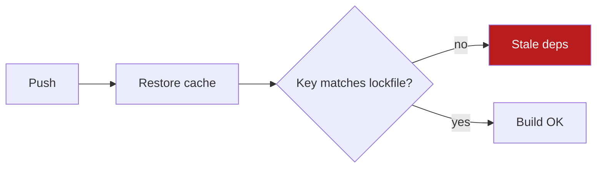

# Rung 2 — Mermaid diagram

- Write Mermaid in a fenced ```mermaid block. Render to an image only if the user asks or the client cannot show Mermaid.
- 4 to 12 nodes. Labels under 4 words. Mark the one node that matters with a class.
- Title states the takeaway: "Cache key skips lockfile", not "Deploy pipeline".
- Keep the rung 1 summary above the diagram.


