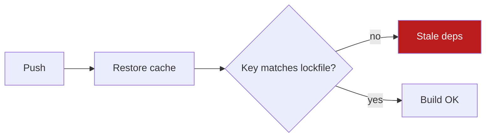

# Rung 2 — Diagram or chart

- Write Mermaid in a fenced ```mermaid block. Render to an image only if the user asks or the client cannot show Mermaid.
- 4 to 12 nodes. Labels under 4 words. Mark the one node that matters with a class.
- Title states the takeaway: "Cache key skips lockfile", not "Deploy pipeline".
- Keep the rung 1 summary above the diagram.



## Chart (one data series or comparison)

- Use it when the shape of the data is the answer: a trend, a correlation, an outlier, a distribution.
- One chart only. Write it as a standalone SVG file (no JS, no external fonts). Convert to PNG only if the client cannot show SVG.
- Title states the takeaway: "Each $1 of ads adds $4.38 in sales". Label axes with units. Annotate the one point that matters.
- Keep the numbers that decide the question in the rung 1 text. The chart is support, not the answer.
